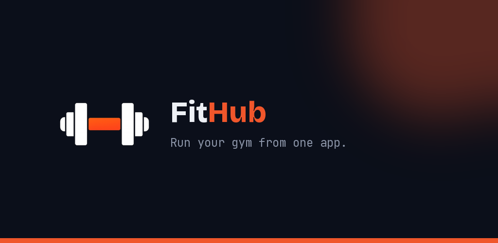
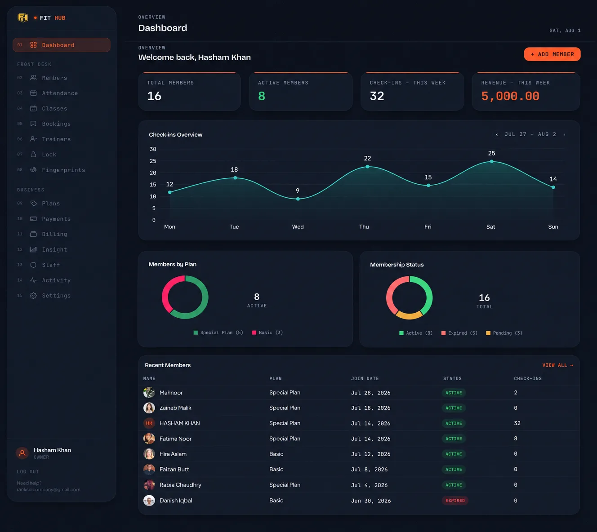

# FitHub



A multi-tenant gym management platform: a staff dashboard for running a gym
day to day, a member-facing mobile app, and IoT firmware that lets members
unlock a door with their own phone or fingerprint — no keys, no front-desk
buzzer.

## Problem

Most small-to-mid-size gyms run on paper registers, a WhatsApp group for
class bookings, and a person at the front desk who has to physically let
members in and out. There's no single place to see who's paying, who's
about to lapse, who showed up this week, or how a class is filling up — and
renewal/class reminders either don't happen or eat someone's afternoon
sending them by hand.

FitHub replaces that with one system: gym staff get a dashboard, members get
an app, and the door itself becomes part of the software instead of a
separate problem.

## What's in here

FitHub is multi-tenant — one deployment serves many gyms:

- **Platform admin** (RankSol) — onboards gyms, manages their subscription
  plans and billing, and gets a cross-gym view of the business.
- **Gym dashboard** — each gym's staff manage members, attendance, classes
  and bookings, trainers, plans, payments, lock devices, and fingerprint
  enrollment from a branded Livewire panel.
- **Member app** — gym members log in, check in with a QR code, book
  classes, log body measurements and track progress, and get push
  notifications for reminders — all backed by the same Laravel API.
- **Physical access** — two independent ESP32 firmware projects:
  [`esp32-lock/`](esp32-lock) polls the backend to remote-unlock a gym door
  or locker (with fingerprint-sensor check-in support), and
  [`office-lock/`](office-lock) is a fully standalone door controller with
  no backend dependency at all, for internal office use.

## Screenshots

**Gym staff dashboard**



## Tech stack

**Backend** — Laravel 11, Livewire 4, Sanctum (API token auth), Cashier +
Stripe (subscription billing), Twilio (SMS reminders), Resend/SMTP (email),
Firebase Cloud Messaging via `kreait/laravel-firebase` (push), Spatie
Backup, Sentry, Tailwind CSS + Vite, Chart.js.

**Mobile** — Flutter/Dart, Riverpod for state management, FCM for push,
`fl_chart` for the progress screen.

**IoT** — ESP32 (Arduino framework, PlatformIO), relay-driven electric
strike, capacitive fingerprint sensor.

## Repository layout

```
backend/       Laravel API + Livewire dashboards (platform, gym, marketing site)
mobile/        Flutter member app (Android/iOS)
esp32-lock/    Backend-connected door/locker lock + fingerprint check-in
office-lock/   Standalone WiFi door lock, no backend
```

Each has its own README with setup details:
[backend](backend/DEPLOY.md) (deployment) ·
[mobile](mobile/README.md) ·
[office-lock](office-lock/README.md)

## Getting started

1. **Backend** — Laravel app under `backend/`. Copy `.env.example` to
   `.env`, set up a MySQL database, run `composer install`, `php artisan
   migrate`, `npm install && npm run build`. See
   [backend/DEPLOY.md](backend/DEPLOY.md) for the full production checklist
   (cron, Stripe webhook, Firebase service account, required env vars).
2. **Mobile app** — Flutter app under `mobile/`. See
   [mobile/README.md](mobile/README.md) for Firebase setup and pointing the
   app at your backend.
3. **Lock firmware** — PlatformIO projects under `esp32-lock/` and
   `office-lock/`. The latter needs no backend at all — see its
   [README](office-lock/README.md).

---

Built by [Hasham Khan](https://github.com/hashamkhan11).
